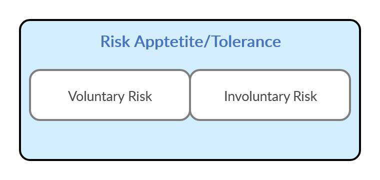

> **"Knowledge is an unending adventure at the edge of uncertainty"**
> (Jacob Bronowski, 1908-1974, British Mathematician, Biologist and Inventor)

# <i class="fas fa-robot"></i> Introduction

Cyber Incident Response is an essential component of Information and Communication technologies which are naturally prone to vulnerabilities and thus exposed to threats that operate in multiple layers. The **cybersphere** is under *perpetual attack* with threats to data Confidentiality, Integrity and Availability increasing over time as the Internet of Things brings higher levels of interconnectedness.

Entities in the cybersphere require constant vigilance and protection to build a layer of resilience against potential attacks in order to mitigate damage and reduce their future exposure. As such, **Cyber Incident Response provides tactical and operational capabilities** to defend against cyber attacks in the most effective manner.

A quick glance at some known statistics shows how crucial Security Incident Response (SIR) Teams have become. [Symantec's Internet Security Threat Report](https://www.symantec.com/content/dam/symantec/docs/reports/istr-24-2019-en.pdf) released at the beginning 2019 provides some interesting figures: one in ten URLs are malicious, mobile ransomware went up 33% compared to 2018, supply chain attacks went up 78% compared to 2018, a 100% increase in malicious powershell scripts for the same period. The University of Sydney in Australia published a [study](https://papers.ssrn.com/sol3/papers.cfm?abstract_id=3102645) where they estimate that around $76 billion of illegal activity per year involves bitcoin which is close in scale to the aggregated US and European illegal drugs markets. A couple weeks before this article was written, the world was in chaos due to [CVE-2019-19781](https://support.citrix.com/article/CTX267027), an unpatched vulnerability in Citrix Netscalers (one of the most ubiquitous Load Balancers/Proxies at the corporate level).

At the same time, the amount of *publicly available information* to threat actors has also increased compared to 5 years ago. Platforms like [Shodan](https://shodan.io), [ExploitDB](https://www.exploit-db.com/), [Hunter](https://hunter.io/), [ThreatCrowd](https://www.threatcrowd.org/), [FOCA](https://www.elevenpaths.com/labstools/foca/), [Censys](https://censys.io), [ZoomEye](https://www.zoomeye.org/) etc. empower not only the good but the bad guys too (there are even [DEFCON presentations](https://www.defcon.org/images/defcon-18/dc-18-presentations/Schearer/DEFCON-18-Schearer-SHODAN.pdf) on how to leverage tools like shodan). It is now easier than ever to launch more targeted attacks against assets with specific vulnerabilities with relatively low costs of operation. In all of these instances, organisations that had a SIR team (or that at least had the ability to call on one) were ten steps ahead of those that had not.

# <i class="fas fa-shield-alt"></i> What is Incident Response?

Let's begin with a one-sentence definition of IR that we can easily commit to memory:

> Cyber Incident Response is the series of organized actions that are triggered due to a disruption that poses a threat to business operations

This disruption does not need to cause an immediate damage to the business' continuity but it carries the potential to do so. Incident Response is the process of **coordinating effort** towards the identification, containment and remediation of a cyber threat with the goal to minimize organizational damage and reduce its future occurrence. It achieves this by adopting *structured strategies* and developing *action plans*.

Putting in motion an IR plan is easier said than done *when operating in a context of informational uncertainty and ambiguity*. Cyber Security Responders need to get used to be comfortable being uncomfortable. We argue that the one very important and often overlooked factors that **attenuates the effect** of informational uncertainty and ambiguity is having a good understanding of the **decision making models** that underpin our operational choices. More over, we hypothesize that building **trust** within your SIR team is essential for the cohesiveness of any decision making process. We will speak about these aspects in the [next section](./ir12-risk-and-decision-making)

# <i class="fas fa-code-branch"></i> Decision Making in a Context of Uncertainty and Ambiguity 

People that have been in the trenches during Incident Response know that we are usually not allowed *the luxury of irrefutable truths*. Even with the best of plans, your team will aim to be "close enough" to certainty rather than 100% exact. You may be wrong later about something you were certain a few hours ago when the incident was detected, the opposite is also true. By its very concept, IR means you will be defining *risk gradients* and move within a **spectrum of certainty**. An *incident* (of any type) is by definition something that happens **outside of our control** and for which we are not completely ready.

> There is a **quantum of reality** contained within something that occurs with the force of the unexpected that **cannot be assimilated** by the predictable flow of experience we live in, unless we invoke a rebalancing process that alters the structure of that flow.

This, however, does not mean we cannot **prepare for it**, something can happen outside of our control but it can still be **anticipated**, within certain parameters that are defined by our perception of *risk*. So, in some way, *you can reclaim control over the unexpected*.

Let's put it this way, every day you jump into a car, you buckle up knowing this could save your life in the event of an accident. You don't drive every day *expecting to be hit by a car*, but since you anticipate the possibility of it, you take necessary measures to minimize the bad consequences of such an incident. This, in turn, *affects your perception of risk*, you drive a car **feeling safer** because of the seatbelt. The fact you just "feel" safer does not imply you are not at the same time "objectively safer" (however the opposite is also true: you may *feel unsafe* whilst actually being *objectively safer* than you allow yourself to believe).

Cyber Security Operations in general, and IR in particular, are intimately linked to your organisations' risk matrix. *Conducting business*, of any kind, means to take risk. There is however, a difference between **risk we take** and **risk we face** (Peter Gluckman, 2016)[^NZPMCSARisk]. The former refers to those risks we take voluntarily based on the following judgement: the benefits they will return, outweigh the likelihood or magnitude of potential harm due to our exposure to the threats derived from our decision. The latter though, represents those risks we don't choose willingly but we have to deal with forcibly.

We might drive the safest of cars and take all required precautions, but we can't usually predict the likelihood of the car in front of us having an accident whose consequences have an impact on us, causing further cascading effects. When institutions talk about **risk** they are referring to the combination of both risk types. The reason is simple, both types of risk are intimately intertwined since *accounting for the risk you might face* is a default activity of *risk management*. You can, to some degree, anticipate the *risks you face* (those forcibly imposed on you) by applying the same decision mechanisms you apply to any other risk: **evaluating conflicting scenarios and projecting occurrence likelihood**. Going back to our car driving examples, you can account for involuntary risks by adopting a **defensive driving** approach: driving at certain distances from the next car up, taking extra precautions during weekend nights (higher likelihood of other people "drink-driving"), etc.

## Defining Risk

We have been speaking about risk as an intimate component of decision making during incident response, however, how is risk best defined? [ISO 3100](https://www.iso.org/obp/ui/#iso:std:iso:31000:ed-2:v1:en) defines risk as the "effect of uncertainty on objectives". So risk is an expression of the consequences that might arise from the pursuit of our objectives. It represents both *metadata* about those consequences in the form of probabilities and *actual* impact to our integrity in the form physical, mental or reputational damage.

Risk is comprised of three components: **vulnerability, impact and threat**.

These components can be, in turn, qualitatively broken down further. We shall expand on these concepts in the next section, however, what concerns us at the moment is how to better understand risk in the context of IR, in other words, how our decisions affect the course of an investigation.

## <i class="fas fa-bug"></i> The Decision Problem in Incident Response

Organizations face the task of allocating scarce resources towards the administration and operation of activities whose requirements usually exceed available capabilities. Incident Response is no exception to this problem and many SOC and SIR teams struggle to find the appropriate resourcing (funding, personnel, skills) to successfully respond to threats. However, even when armed with enough resources, lack of appropriate IR Procedures and Strategy can obstruct an investigation's process.

> Plans, Procedures and Strategies are different *abstractions* to capture *possible combinations* of an essential element that nurtures all forms of human activity: **decision making**.

This is why, regardless of your resourcing supply, IR requires a structured approach to decision making. The purpose of it is always the same: **to optimize resource utilization and increase  effectiveness in achieving our goals**. To overcome this obstacle we, as responders, need to draw from different models that help us understand how decision making works. This is usually a poorly explored topic in most IR books that only make a reference to the OODA loop and believe that's all there is to say about it.

On the contrary, it has been proven that *the use of multiple models in decision making creates better predictors for the succes or failure of a particular strategy* (see for example the use of this approach in epidemiology, *Ensemble Modelling and Structured Decision-Making to
support Emergency Disease Management*, 2017)[^SDMBio]. Models are just that, **an abstract representation to describe a phaenomenon**, *like a map is to actual terrain*. They offer a simplified perspective on complex phaenomena and, in doing so, they reduce complexity in order to help us understand it. The end goal of decision making models is to offer **approximate representations of pragmatic courses of action**.

As such, in the next section, we will be exploring decision making models and how they relate to risk.

[^NZPMCSARisk]: Professor Peter	Gluckman, Chief	Science	Advisor, New Zealand, Making decisions in the face of uncertainty: Understanding risk.
[^SDMBio]: Webb, Colleen, Ferrari, Matthew, Lindstrom, Tom, Carpenter, Tim, Durr, Salome, Garner, Graeme, Jewell, Chris, Stevenson, Mark, Ward, Michael, Werkman, Marleen, Backer, Jantien and Tildesley, Michael J. (2017) Ensemble modelling and structured decision-making to support emergency disease management. Preventive Veterinary Medicine, 138. pp. 124-133